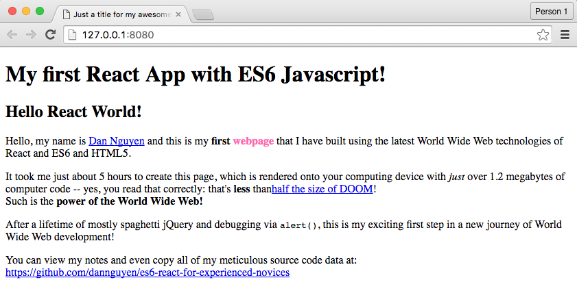

# The Experienced Novice's Guide to ES6, React, and Modern JavaScript Development

Rebuilding the canonical React tutorial in ES6 because I don't even know regular JavaScript anyways so whatever

### Step 1: Hello React!

[Notes](STEP-01.md)  

[Site](http://dannguyen.github.io/es6-react-for-experienced-novices/steps/01/)

[Source](https://github.com/dannguyen/es6-react-for-experienced-novices/tree/v01)

- Instantiate a new packaged NPM project.
- Install development dependencies of React, webpack, and Babel.
- Create configurations for webpack and Babel.
- Create scripts for `npm run`
- Write a Hello World React app using ES6.
- Configure webpack-dev-server and test locally.
- Configure the build parameters to create a standalone page with `build.js`

## Tutorials to rebuild

[React Official Tutorial](https://facebook.github.io/react/docs/tutorial.html)

[Thinking in React](https://facebook.github.io/react/docs/thinking-in-react.html)

## References

- https://github.com/addyosmani/es6-equivalents-in-es5
- https://facebook.github.io/react/docs/jsx-gotchas.html
- http://jamesknelson.com/learn-raw-react-no-jsx-flux-es6-webpack/

## Alternatives

https://github.com/newtriks/generator-react-webpack
